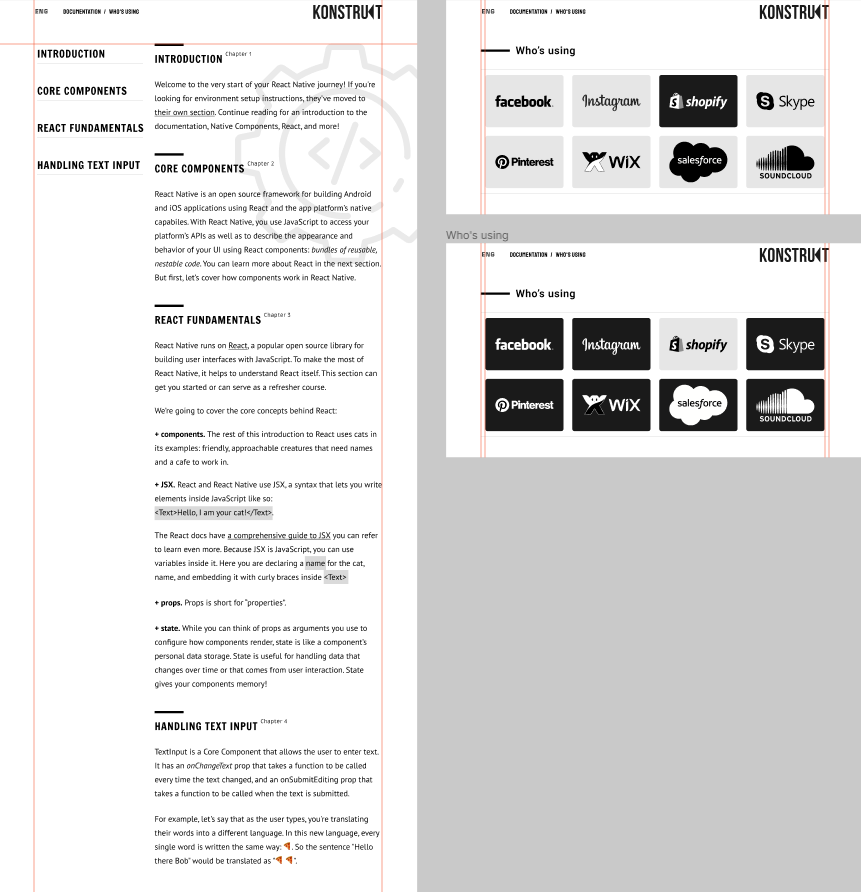

# BeetRootEducation

_LMS Beetroot Academy progress_

## ДОМАШНЄ ЗАВДАННЯ

**Обов'язково:**

- Зверстати сторінку [Documentation.](https://www.figma.com/file/FP2fHfIElPk4J42DYQGuMw/position-transform)

  ТЗ:

  Header сторінки має бути зафіксований до верху
  Сайдбар має прилипати до верху при скролі (position sticky)
  Патерн (фоновий малюнок) також має лишатись на місці (прилипати) при скролі цієї секції

**Екстра:**

- Зверстати сторінку [Who's using?](https://www.figma.com/file/FP2fHfIElPk4J42DYQGuMw/position-transform)

  ТЗ:

  При ховері карточки має відбуватись ефект перевертання її і зміна сірої сторони на чорну з заміною кольору логотипу — як в посиланні.

